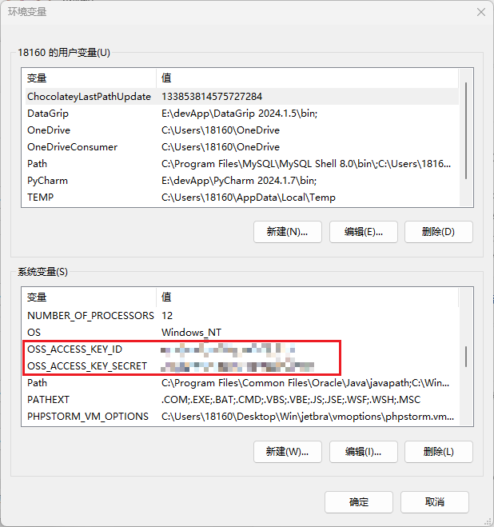

## 一、项目说明

该项目是基于springboot3.4.7和vue3打造教学管理系统

前端项目地址：[Dr-Kaisa/easy-school-management-system-front-end](https://github.com/Dr-Kaisa/easy-school-management-system-front-end)

### 项目demo
用户名可选shinaian、songjiang，密码都是123456

click -> [demo](http://101.132.184.148/login)

运行环境包括：

- mysql8.0
- java21
- maven3.10

## 二、项目演示


## 三、使用说明

1、将项目数据库导入到mysql

2、由于用到了阿里云OSS，需要自行去[官网](https://oss.console.aliyun.com/)注册并开通OSS服务

3、在阿里云服务台获取到AccessKey ID 和 AccessKey Secret 并加入系统变量



4、自行更改项目配置文件application.yml中的OSS配置和数据库配置等

5、下载相关依赖

```bash
mvn install
```

6、运行


